# Experimental DC Motor Control in MATLAB

Academic project on the experimental modelling, identification and closed-loop control of a DC motor. The work combines theoretical design, MATLAB simulation and laboratory validation using an Arduino-based experimental platform.

> This is a curated portfolio version of an academic team project completed in the Control course of the BSc in Electrical and Computer Engineering at Instituto Superior Técnico. It contains the analysis and processing scripts developed by Rómulo Yan. The original laboratory acquisition helpers supplied with the course are deliberately not included.

## Project scope

The project follows the full control-design workflow:

1. identify a first-order DC-motor model from step and frequency-response experiments;
2. characterise the motor dead zone from positive and negative ramp experiments;
3. design and compare P, I and PI controllers for angular-velocity control;
4. design and compare PD and PID controllers for angular-position control;
5. validate the designs experimentally and quantify tracking error, settling time, overshoot and control effort.

The identified velocity model is:

\[
G_\omega(s) = \frac{0.1924}{s + 2.1119}
\]

The corresponding position model is:

\[
G_\theta(s) = \frac{0.1924}{s(s + 2.1119)}
\]

## Selected results

- Estimated static gain: `k0 = 0.0911`.
- Estimated dynamic parameter: `a = 2.1119 s⁻¹`.
- Measured dead-zone thresholds: approximately `-26.17` and `+33.27` PWM units.
- Selected velocity PI controller: `kω = 30`, `ki = 60`.
- Experimental velocity-control settling time: `0.2314 s`.
- Experimental velocity-control overshoot: `4.42%`.
- Position-control comparison: PD (`k1 = 70`, `k2 = 35`) and PID controllers with `k3 = 20` and `k3 = 40`.

## Repository structure

```text
matlab/
├── Lab1_analise.m          # system identification and frequency-response analysis
├── Lab2_analise.m          # velocity and position-control design/analysis
├── Lab3_analise.m          # position-control validation and metrics
├── Bode.m                  # asymptotic Bode plot
├── Bloco4b.m               # frequency-response acquisition/processing workflow
├── Data/                   # expected location for experimental datasets
└── Image/                  # output folder for generated figures
docs/
└── attribution.md          # authorship and dependency notes
```

## Source code

The MATLAB source is available directly in the [`matlab/`](matlab/) folder:

- [`Lab1_analise.m`](matlab/Lab1_analise.m) — dead-zone identification, step-response identification and frequency-response analysis.
- [`Lab2_analise.m`](matlab/Lab2_analise.m) — design and analysis of P, I, PI, PD and PID controllers, including experimental velocity-control processing.
- [`Lab3_analise.m`](matlab/Lab3_analise.m) — dedicated position-control validation, experimental comparison and tracking-error metrics.
- [`Bode.m`](matlab/Bode.m) — asymptotic Bode plot for the identified model.
- [`Bloco4b.m`](matlab/Bloco4b.m) — frequency-response acquisition and post-processing workflow.

See [`matlab/README.md`](matlab/README.md) for the execution order, dependencies and expected data layout.

## Requirements

- MATLAB (tested in the 2025/2026 course environment);
- Control System Toolbox;
- experimental data placed in `matlab/` and `matlab/Data/`.

The raw MATLAB datasets are retained privately in this initial public release because they originate from an academic group-laboratory environment. The repository documents the full analysis workflow and the measured results. Sections that start a new physical experiment require the course-provided acquisition functions and the Arduino-based setup; these functions are not redistributed here.

## Running the analysis with access to the dataset

1. Obtain or prepare the experimental files in the layout shown under `matlab/` and `matlab/Data/`.
2. Open MATLAB and set the current folder to `matlab/`.
3. Run `Lab1_analise.m` for identification and frequency-response analysis.
4. Run `Lab2_analise.m` for controller design and velocity-control analysis.
5. Run `Lab3_analise.m` for the dedicated position-control validation and metrics.

The legacy MATLAB comments remain in Portuguese because they are part of the original academic working scripts. This README and all new documentation are in English.

## Selected results and experimental evidence

This section presents the results in the same order as the technical workflow, rather than showing only the final controller comparison.

### 1. Experimental identification

| Applied ramps and measured motor speed | Dead-zone characterisation |
| --- | --- |
| 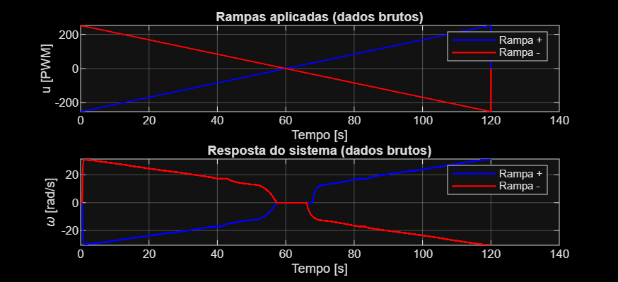 | 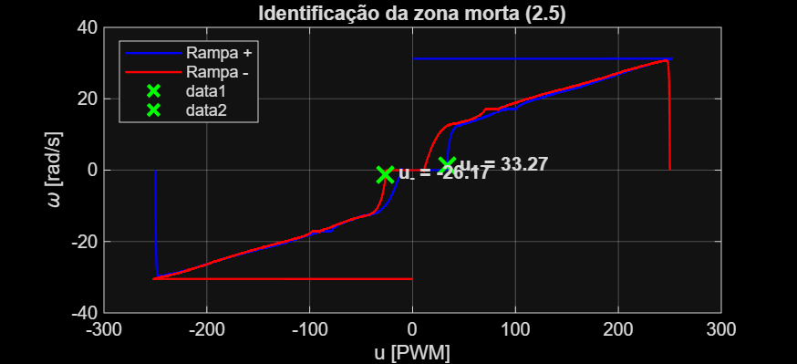 |

| First-order step-response identification | Frequency-response measurement |
| --- | --- |
| 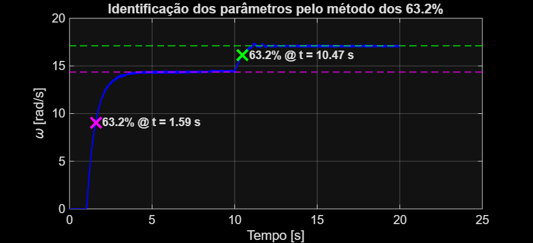 | 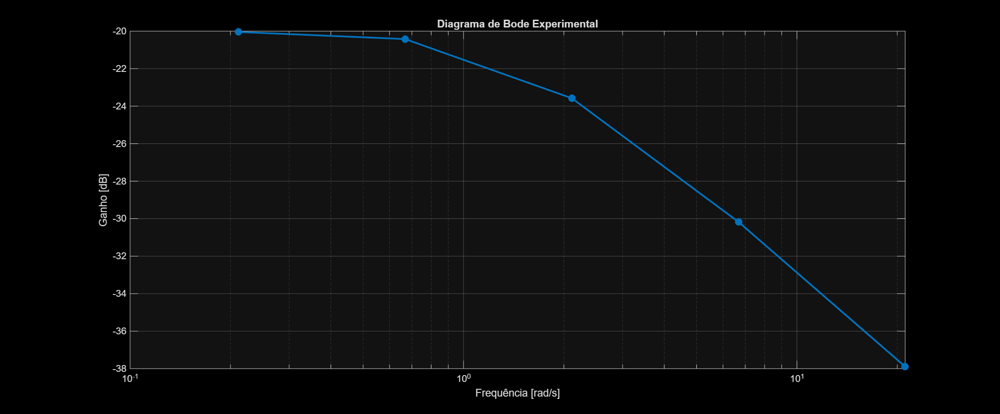 |

The ramp tests provide the measured dead-zone thresholds, approximately `-26.17` and `+33.27` PWM units. The step response identifies the first-order dynamics, while the Bode result independently checks the frequency-domain behaviour.

### 2. Velocity-control design and validation

| Closed-loop design comparison | Experimental P, I and PI comparison |
| --- | --- |
| 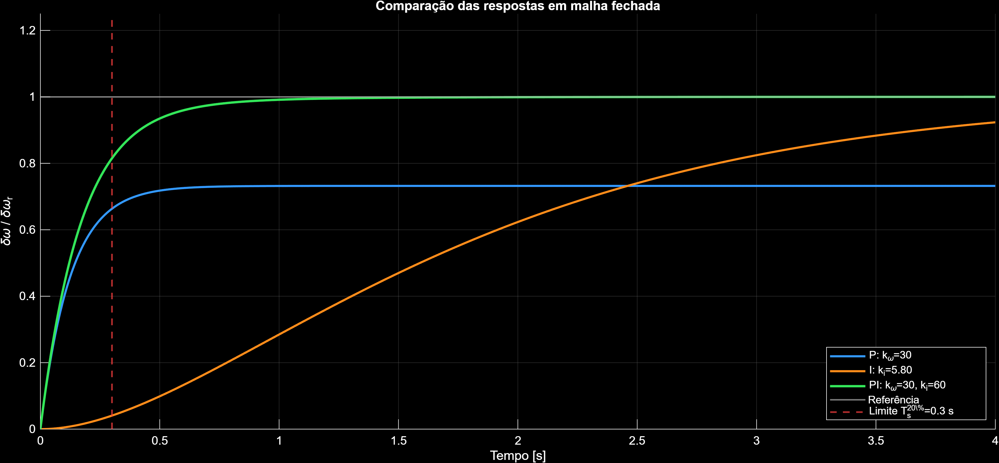 | 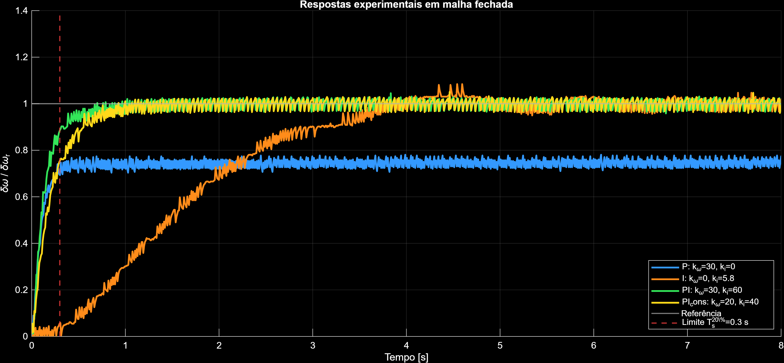 |

| PI model-versus-experiment validation |
| --- |
| 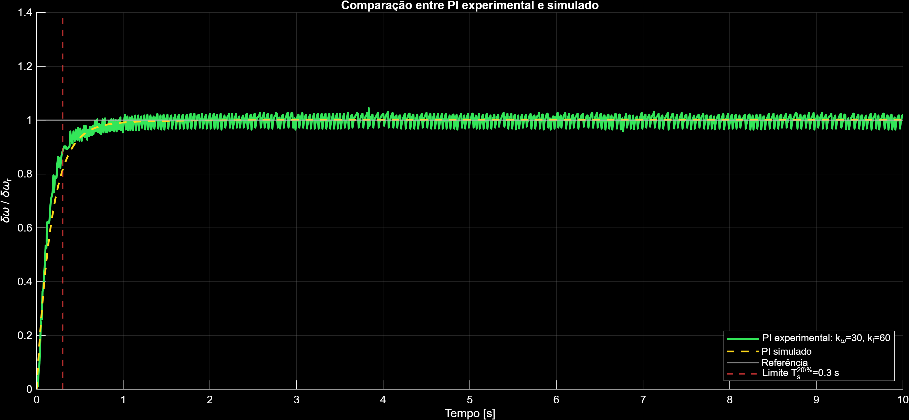 |

The selected PI controller (`kω = 30`, `ki = 60`) was assessed against the measured response. The experiment yielded a settling time of `0.2314 s` and overshoot of `4.42%`.

### 3. Position-control design and experimental validation

| PD/PID ramp tracking | Experimental angular-position response |
| --- | --- |
| 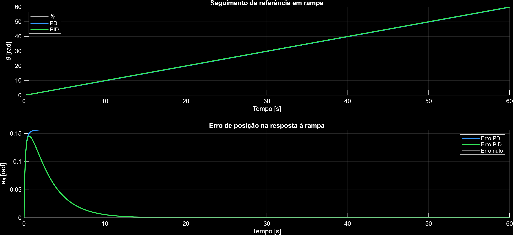 | 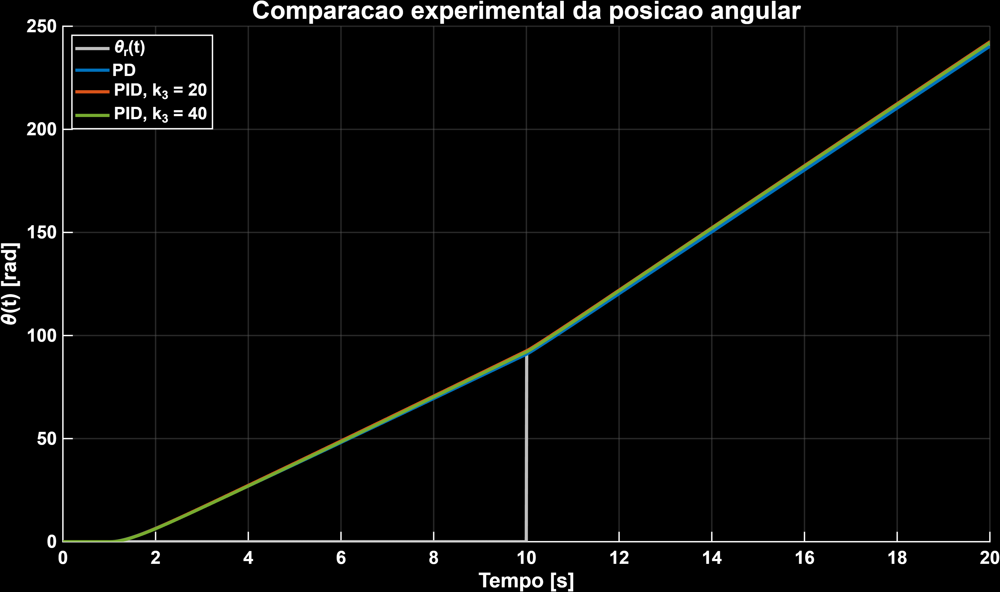 |

| Position-tracking error | Control effort |
| --- | --- |
| 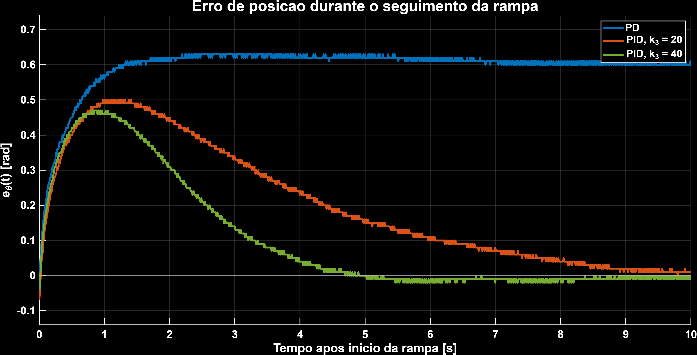 | 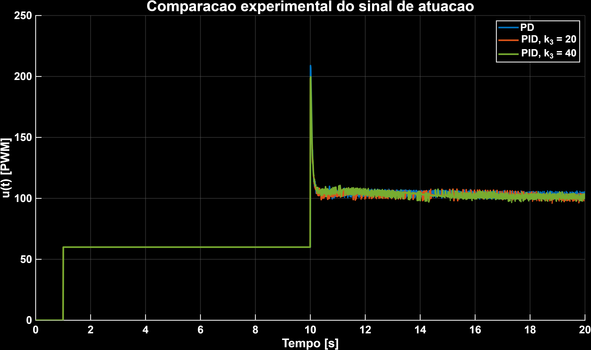 |

The position-control comparisons cover tracking accuracy and the corresponding actuation signal, so the controller is assessed on both output performance and control effort.

The plots retain their original Portuguese labels as generated by the academic MATLAB scripts. They are included as unmodified experimental outputs; the surrounding documentation is in English.

## Authorship and academic context

See [docs/attribution.md](docs/attribution.md). This repository is intended to document technical work and results; it is not a replacement for the original academic submission.
